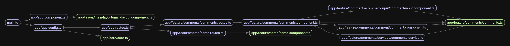

# Limble Comments Challenge

This project was generated with [Angular CLI](https://github.com/angular/angular-cli) version 18.0.6.

## Description

This is a project for the Limble Coding Challenge, earlyJuly 2024. It uses Angular v18 and TypeScript. The main goal was to create a user tagging component that allows users to mention other users within comments, similar to Slack.

### Dependencies

The project uses Angular v18 and TypeScript along with Angular Material and Tailwind CSS for stylings.

There are no circular dependencies in this project as all features are self-contained.

Diagrams and screenshots of the project are available in the [docs](docs) folder.

### Application Screens

'

## Getting started

### Install

Required to have the version 20.12.2 or higher of [Node.js](https://nodejs.org/en/download/package-manager/current) on your machine.

Clone the project from GitHub.

Install the packages by navigating to the project folder and running `npm ci`

### Development server

Run `npm start` for a dev server. Navigate to `http://localhost:4200/`. The application will automatically reload if you change any of the source files.

### Build

Run `ng build` to build the project. The build artifacts will be stored in the `dist/` directory.

### Running unit tests

Run `ng test` to execute the unit tests via [Karma](https://karma-runner.github.io).
